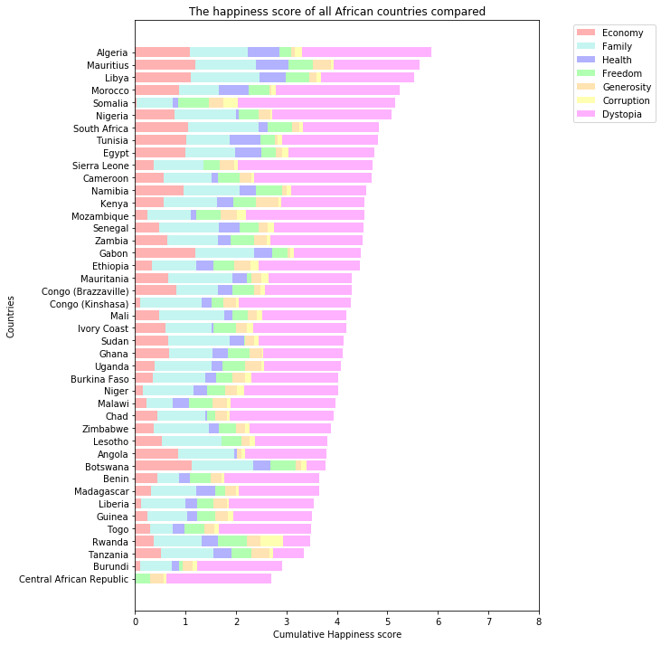

# Analyse de "happiness scores" dans les différents pays et sur différents continents
## faite dans le cadre du cours EPFL "Applied Data Science"

L'analyse complète se trouve dans le notebook Jupyter, mais voici quelques graphiques pour illustrer l'analyse:

1. Graphiques montrant la variation de scores de satisfaction en fonction les uns des autres

2. Cumul des scores de satisfaction par pays, sur le continent africain

3. Distribution du score de satisfaction au travail, pour tous les pays

