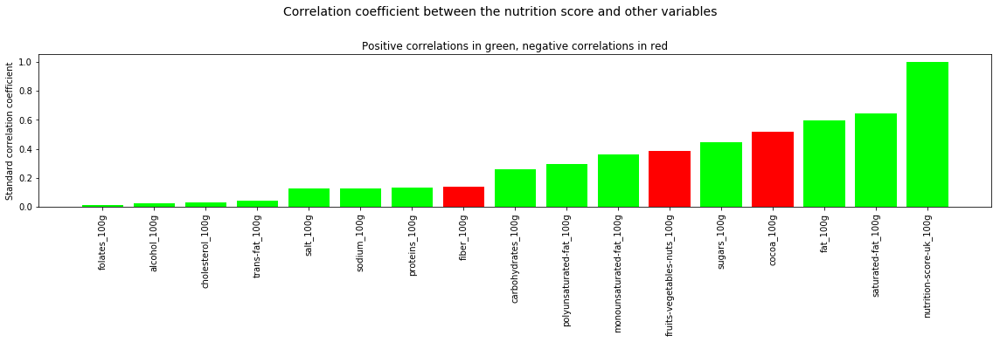

# Analyse de données de nutrition
## faite dans le cadre du COS EPFL Extension School, "Applied Data Science: Machine Learning".

Le détail des données, en accès public, se trouve ici:
[openfoodfacts - URL](https://static.openfoodfacts.org/data/data-fields.txt) 

L'analyse a été faite dans un notebook Jupyter (en version statique sur Github).

En voici quelques graphiques.

1. Correlation entre le score nutritionnel, et différentes autres variables

