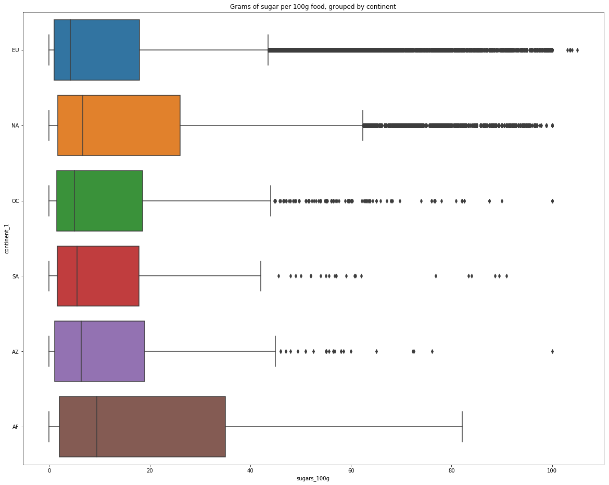
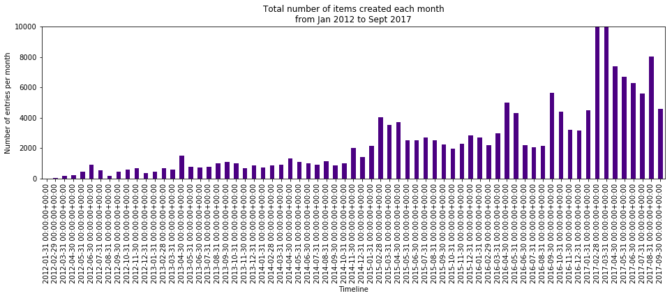

# Analyse de données de nutrition
## faite dans le cadre du COS EPFL Extension School, "Applied Data Science: Machine Learning".

Le détail des données, en accès public, se trouve ici:
[openfoodfacts - URL](https://static.openfoodfacts.org/data/data-fields.txt) 

L'analyse a été faite dans un notebook Jupyter (en version statique sur Github).

En voici quelques graphiques.

1. Correlation entre le score nutritionnel, et différentes autres variables

2. Quantité de sucre dans les aliments, par continent

3. Nombre de nouvelles entrées dans la base de données en fonction du temps (zoom)

